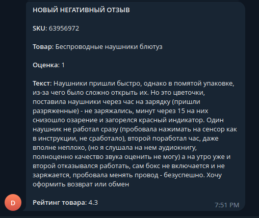
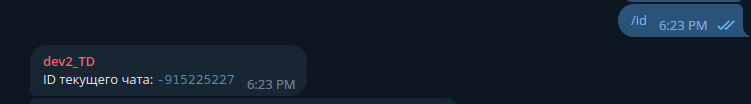

## WB Parser
```Python 3.11``` ```Aiogram``` ```Redis```

## Description
The bot collects information about new negative reviews every 120 minutes (the time can be changed in the bot settings).
Data about the SKU number of products to be parsed is stored in a database (Redis). If you want to add or remove data for parsing, use the bot menu.

## Pre installation
### 1. Create virtual local-environment
```bash
python3 -m venv venv && source venv/bin/activate
```
### 2. Install dependencies
```bash
pip install -r requirements.txt
```
### 3. Set global environment variables
```bash
cp .env.example .env
```
### 4. Get a telegram bot token from https://t.me/BotFather
### 5. Create a group in telegram. Add your bot there and give it administrator rights
### 6. Get the chat ID by sending the "/id" command to your new chat
### 7. Specify in the .env-file your bot-token and your chat ID for sending messages
### 8. Simple start
```bash
python3 bot.py
```
### MESSAGE EXAMPLE

### HOW TO GET CHAT ID

